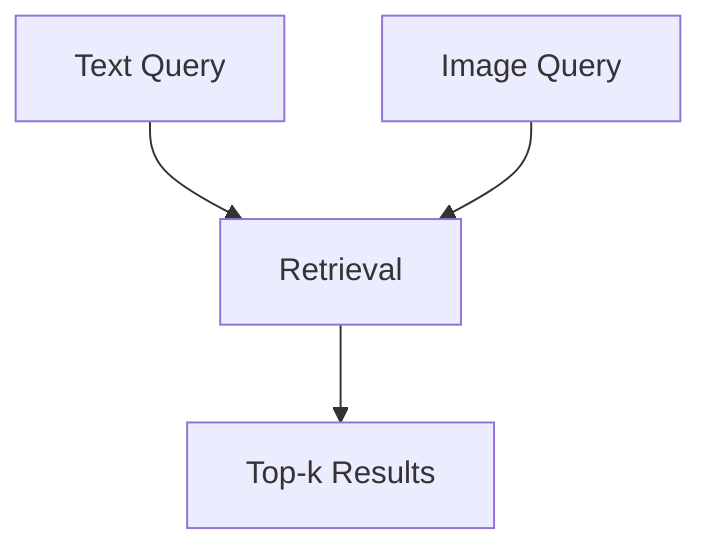

# 01 — Project Overview

## Project name

`IS6303_RecipeImageRetrieval`

## Course

IS6303 — Data Mining / Information Retrieval project

## Assignment

A1 — Semantic Search System

## Dataset

[`ANDREEEWW/recipe-with-images`](https://huggingface.co/datasets/ANDREEEWW/recipe-with-images) (Hugging Face)

## 1.1 Problem

Build a semantic search system where a user submits a free-text query (e.g. an ingredient, a dish name, or a description of what they want to eat) and receives the most relevant recipe **images** from the `recipe-with-images` dataset.

The dataset couples each image with a recipe name, an ingredient list, and a short description, so this is effectively a **text → recipe → image** retrieval problem, not raw image search.

## 1.2 Motivation

Keyword-only (lexical) retrieval matches exact word overlap. This fails when a user's words differ from the dataset's vocabulary even though the underlying concept is the same.

```text
Query:
"quick vegetarian breakfast"

Lexical retrieval:
Looks for the literal tokens "vegetarian", "breakfast", "quick"
in the recipe text. A recipe titled "Pomegranate Yogurt Bowl"
with no explicit "vegetarian"/"breakfast" tokens may be missed
or ranked low.

Semantic retrieval:
Should recognize that a yogurt-and-fruit bowl is conceptually
a vegetarian breakfast even without exact keyword overlap.
```

## 1.3 Objective

The system should:

1. Accept a free-text query.
2. Search the recipe dataset (name + ingredients + description).
3. Retrieve relevant candidate recipes.
4. Rank the candidates.
5. Display the top-k recipe images (with name/ingredients as context).
6. Compare different retrieval strategies (BM25, Dense, Hybrid, Hybrid + Reranker).

## 1.4 Scope

Current scope:


Potential future scope (not required for the first implementation):



## 1.5 Relation to the original plan

This project follows the same documentation methodology as the original `CMIngre`-based plan, but uses `ANDREEEWW/recipe-with-images` as the dataset. All dataset-specific facts in this documentation set (fields, split sizes, example content) were pulled directly from the Hugging Face dataset card and dataset-viewer API — see `03_DATASET.md` for details and citations. Nothing about the dataset is invented.
