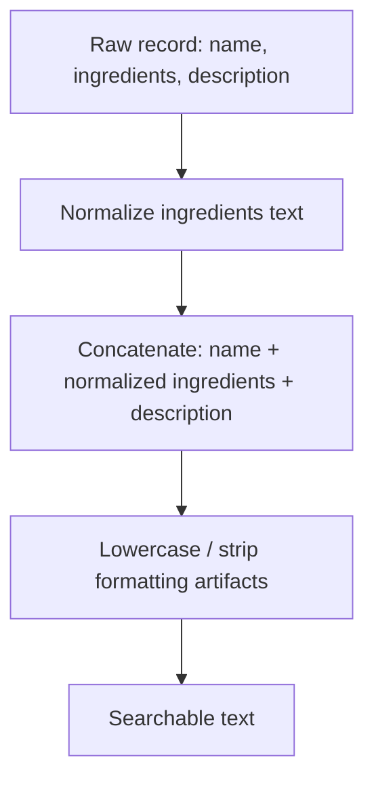

# 03 — Dataset

Dataset: **`ANDREEEWW/recipe-with-images`**

Source: https://huggingface.co/datasets/ANDREEEWW/recipe-with-images

All facts below were confirmed via the Hugging Face Datasets API (`/api/datasets/ANDREEEWW/recipe-with-images`) and the `datasets-server` rows endpoint on 2026-09-10. No field or statistic here is invented.

## 3.1 Dataset overview

- **Purpose**: recipes paired with a photo of the finished dish, for recipe/food retrieval and captioning-style tasks.
- **Modalities**: image + text (image is a real photo; text = recipe name, ingredient list, short description).
- **Size**: two splits.

| Split | Examples | Size (bytes) |
|---|---|---|
| train | 36,404 | ~1.89 GB |
| test | 15,603 | ~0.68 GB |
| **Total** | **52,007** | ~2.57 GB (download size ~0.95 GB, parquet-compressed) |

- **File format**: Parquet, 4 train shards + 2 test shards.
- **License / annotations**: TODO — not stated in the dataset card metadata pulled; verify on the dataset page before publishing final report if license matters for reuse.
- **Labels**: there is no explicit category/cuisine/label field. "Labels" in the loose sense are only what can be derived from `name` and `ingredients` text.

## 3.2 Dataset schema

Confirmed fields (from `dataset_info.features`):

```text
image          : Image      — the recipe photo (JPEG; sample rows show ~680x454 px, size varies)
name           : string     — recipe title, e.g. "Morrocan Carrot and Chickpea Salad"
ingredients    : string     — free-text ingredient list, often multi-line, includes quantities
                               and occasionally sub-groups (e.g. "Dressing:\n...")
description    : string     — short free-text description of the dish
```

There is **no** `id` field, **no** structured `metadata` field, and **no** explicit ground-truth/category/cuisine field. This differs from the original CMIngre-based plan template, which assumed `id`, `image`, `ingredients`, `metadata` — those field names do not apply to this dataset and must not be reused in code/docs.

### Example record (train split, row 0)

```text
name: "Morrocan Carrot and Chickpea Salad"
ingredients: "Dressing:\n1 tablespoon cumin seeds\n1/3 cup / 80 ml extra virgin olive oil\n
              2 tablespoons fresh lemon juice\n1 tablespoon honey\n... 10 ounces carrots,
              shredded ... 2 cups cooked chickpeas ... 2/3 cup dried pluots, plums, or
              dates ... 1/3 cup fresh mint, torn\nFor serving: toasted almond slices, ..."
description: "A beauty of a carrot salad - tricked out with chickpeas, chunks of dried
              pluots, sliced almonds, and a toasted cumin dressing. Thank you Diane Morgan."
image: 680x454 JPEG
```

Note the `ingredients` field is **not** a clean list of ingredient nouns — it is raw recipe-style text mixing quantities, units, prep instructions, and optional sub-headers (e.g. "Dressing:", "For serving:"). Any downstream use as a bag-of-ingredient-terms will require normalization (see §6.4).

## 3.3 Dataset subset

The full dataset (52,007 rows, ~1 GB download, ~2.5 GB decompressed with images) is likely larger than needed for a course project.

Recommended subset strategy (TODO — finalize the exact size once local resource constraints are known):

- Use the `train` split only as the retrieval corpus (36,404 recipes); reserve part of `test` (or a held-out slice of `train`) for generating evaluation queries so evaluation queries don't leak into the indexed corpus.
- Sample a subset (e.g. 3,000–8,000 recipes) using a fixed random seed for reproducibility, rather than the full 36,404, to keep indexing/embedding time reasonable on a laptop.
- Verify diversity of the subset by checking that recipe names/descriptions span multiple cuisines and dish types (breakfast, salad, main, dessert, etc.) rather than being dominated by one category — since there is no cuisine label, this must be checked qualitatively by sampling names, or by lightweight keyword bucketing (e.g. counting occurrences of cuisine-indicative words) as a proxy.
- Document the exact subset size, seed, and selection code once implemented (Phase 2 in `12_IMPLEMENTATION_PLAN.md`).

## 3.4 Searchable representation



Concretely:

1. Take `name`, `ingredients`, `description` as-is from the dataset.
2. Normalize `ingredients`: strip quantity/unit tokens is optional (TODO — decide experimentally whether removing quantities helps or hurts BM25/dense retrieval; Ablation D in `10_ABLATION_STUDY.md` covers this), but at minimum collapse newlines/sub-headers into plain text.
3. Concatenate fields in a fixed order: `name + " " + ingredients + " " + description`.
4. Store the mapping from each record to its `image` for display at retrieval time.

No metadata field exists to append, unlike the original template's `Title + Ingredients + Metadata` ablation — that ablation variant is not applicable to this dataset and should be dropped or replaced with `Name only` / `Name + Ingredients` / `Name + Ingredients + Description` (see updated Ablation D in `10_ABLATION_STUDY.md`).

## 3.5 Ground truth

**This dataset does not provide a ready-made retrieval ground truth** (no query field, no relevance labels, no category labels). This must be stated clearly and not glossed over.

Reproducible ground-truth strategy (to implement, not yet implemented — mark as TODO until built):

1. **Query generation**: sample N recipes from the held-out slice; for each, generate a natural-language query either (a) manually by the team, or (b) programmatically by extracting a subset of ingredients/description keywords, or (c) using an LLM to paraphrase the `description` into a short query. Record the exact method used — this determines what "relevant" means.
2. **Relevance labeling**: for query-generation method (a)/(c) where the query is derived from one specific recipe, that recipe is the primary relevant item (graded relevance = 1). Additional relevant items (graded relevance ≥ 1) may be identified by near-duplicate ingredient overlap with a defined threshold — this needs manual spot-checking since automatic overlap is only a proxy for true relevance.
3. **Reproducibility**: fix the random seed for query sampling, save the generated query set (query text + source recipe id + any additional labeled relevant ids) to a versioned file (e.g. `experiments/queries.json`) so all retrieval methods in `08_EVALUATION.md` are evaluated on the identical set.

Do not claim any dataset field is a genuine external ground truth. The ground truth here is **constructed by the project team**, and that must be disclosed in the final report and README.
