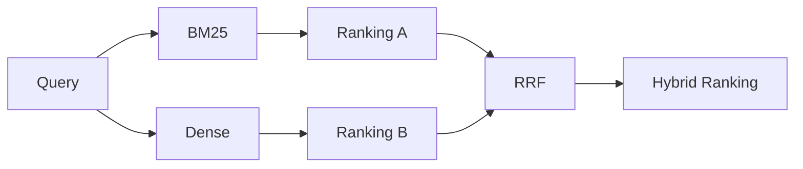

# 04 — Search Concept

Core Information Retrieval concepts used in the project, applied to searchable text built from `name + ingredients + description` (see `03_DATASET.md`, §6.4).

## 4.1 Sparse Retrieval (BM25)

BM25 ranks recipes by lexical overlap between query terms and the recipe's searchable text, weighted by term frequency and inverse document frequency. It is used as the **baseline**: it is cheap, has no training/embedding cost, and is a strong reference point for how much semantic retrieval actually improves over pure keyword matching on this dataset.

## 4.2 Dense Retrieval

Both the query and every recipe's searchable text are embedded into the same vector space; retrieval becomes nearest-neighbor search. Candidate models (final choice TODO, to be selected experimentally per Experiment 2 in `09_EXPERIMENTS.md`):

- `sentence-transformers/all-MiniLM-L6-v2`
- BGE (`BAAI/bge-small-en` or similar)
- E5 (`intfloat/e5-small-v2` or similar)

## 4.3 Hybrid Retrieval

BM25 captures exact ingredient/name term matches (e.g. "chickpea"), while dense retrieval captures conceptual similarity (e.g. "vegetarian breakfast" ≈ yogurt bowl). Reciprocal Rank Fusion (RRF) combines both rankings without needing score calibration between the two systems.

## 4.4 Reranking

A cross-encoder jointly encodes (query, candidate recipe text) pairs for a more accurate but expensive relevance score. Applied only to a small candidate pool (e.g. top-20/50/100 from the hybrid stage — see `09_EXPERIMENTS.md`, Experiment 3), never to the full corpus.
