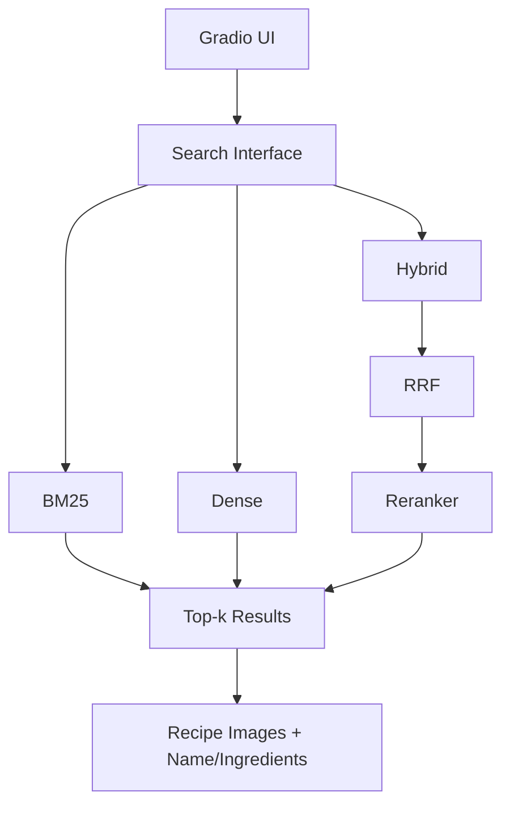
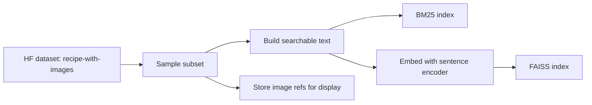

# 05 — System Architecture

The architecture stays simple — this is a course project, not a production system.



## Technology decisions

```text
Language:            Python
Dataset:             Hugging Face Datasets — ANDREEEWW/recipe-with-images
Sparse Retrieval:    BM25 (e.g. rank_bm25 or bm25s)
Dense Retrieval:     Sentence Transformers
Vector Search:       FAISS (in-memory, sufficient for a subset of a few thousand recipes)
Hybrid:              Reciprocal Rank Fusion (RRF)
Reranking:           Cross-Encoder (sentence-transformers cross-encoder model)
Frontend:            Gradio
```

A separate backend/API service is **not required**. Gradio calls Python search functions directly, in-process.

## Data flow at index time


