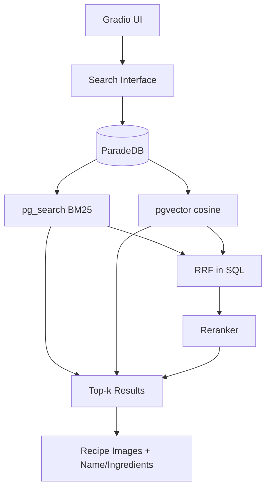
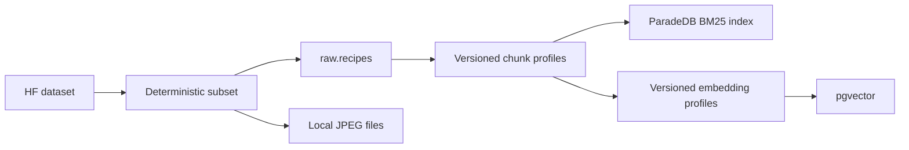

# 05 — System Architecture

The architecture stays simple — this is a course project, not a production system.



## Technology decisions

```text
Language:            Python
Dataset:             Hugging Face Datasets — ANDREEEWW/recipe-with-images
Database:            ParadeDB 0.25.6 / PostgreSQL 17 (Docker)
Sparse Retrieval:    pg_search BM25 (rank_bm25 retained as ablation baseline)
Dense Retrieval:     Sentence Transformers
Vector Search:       pgvector exact cosine (FAISS retained as ablation baseline)
Hybrid:              Reciprocal Rank Fusion (RRF) in SQL
Reranking:           Cross-Encoder in Python
Frontend:            Gradio
```

A separate backend/API service is **not required**. Gradio calls Python
retrievers in-process; they query the local ParadeDB container. Query
embedding and cross-encoder inference remain in Python.

## Data flow at index time



`npm run data:migrate` starts ParadeDB, applies numbered SQL migrations,
ingests the subset, creates chunks/embeddings, and validates both sparse and
dense retrieval. The pipeline is idempotent and records each run in
`retrieval.pipeline_runs`.
