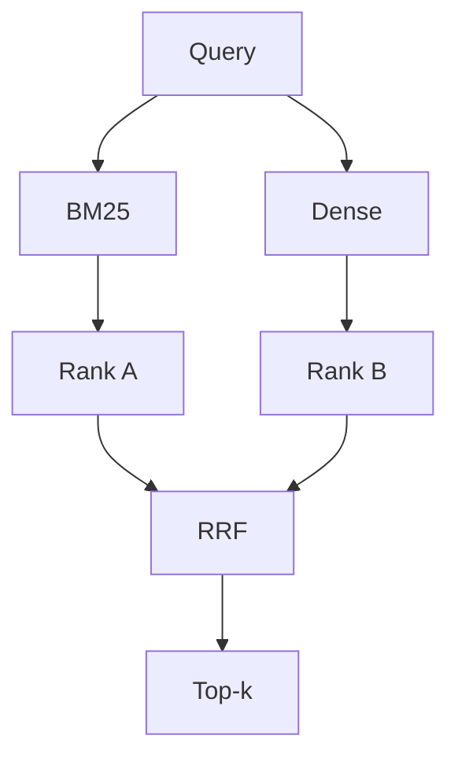

# 07 — Retrieval Methods

Four configurations to be evaluated, all operating over the searchable text built from `name + ingredients + description` (see `03_DATASET.md`).

## 7.1 BM25

Purpose: baseline sparse/lexical retrieval.

The main mode uses ParadeDB `pg_search` and `pdb.score` over
`retrieval.recipe_chunks`. Python `rank_bm25` is retained as an ablation
baseline.

## 7.2 Dense Retrieval

Purpose: evaluate semantic similarity, e.g. matching "vegetarian breakfast" to a yogurt bowl recipe with no literal keyword overlap.

Document chunks are embedded during `npm run data:migrate`; only the query is
embedded online. Exact cosine search runs in pgvector. FAISS `IndexFlatIP`
remains available as a backend baseline.

## 7.3 Hybrid Retrieval

Purpose: combine lexical (exact ingredient/name terms) and semantic signals.

Sparse and dense chunk hits are first aggregated to one score per recipe.
RRF then combines the two recipe rankings in SQL, preventing recipes with
multiple field chunks from gaining an unfair advantage.

## 7.4 Hybrid + Reranker

Purpose: test whether a more expensive second-stage reranker improves retrieval quality over hybrid alone. Candidate pool size N (20/50/100) is varied in Experiment 3 (`09_EXPERIMENTS.md`).

The cross-encoder remains in Python and scores `(query, full recipe text)`;
model inference is intentionally not placed in Postgres.
