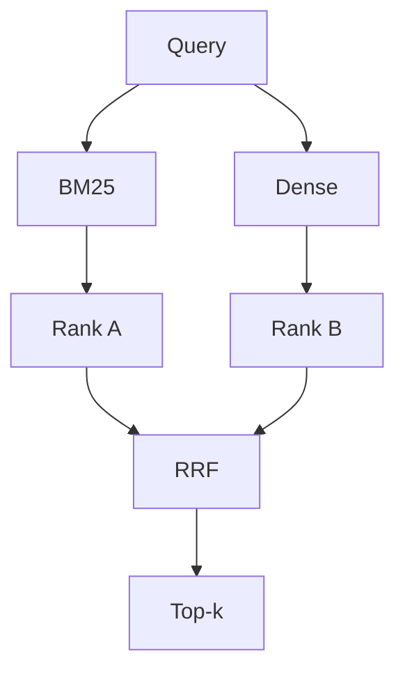

# 07 — Retrieval Methods

Four configurations to be evaluated, all operating over the searchable text built from `name + ingredients + description` (see `03_DATASET.md`).

## 7.1 BM25

Purpose: baseline sparse/lexical retrieval.

## 7.2 Dense Retrieval

Purpose: evaluate semantic similarity, e.g. matching "vegetarian breakfast" to a yogurt bowl recipe with no literal keyword overlap.

## 7.3 Hybrid Retrieval

Purpose: combine lexical (exact ingredient/name terms) and semantic signals.

## 7.4 Hybrid + Reranker

Purpose: test whether a more expensive second-stage reranker improves retrieval quality over hybrid alone. Candidate pool size N (20/50/100) is varied in Experiment 3 (`09_EXPERIMENTS.md`).
